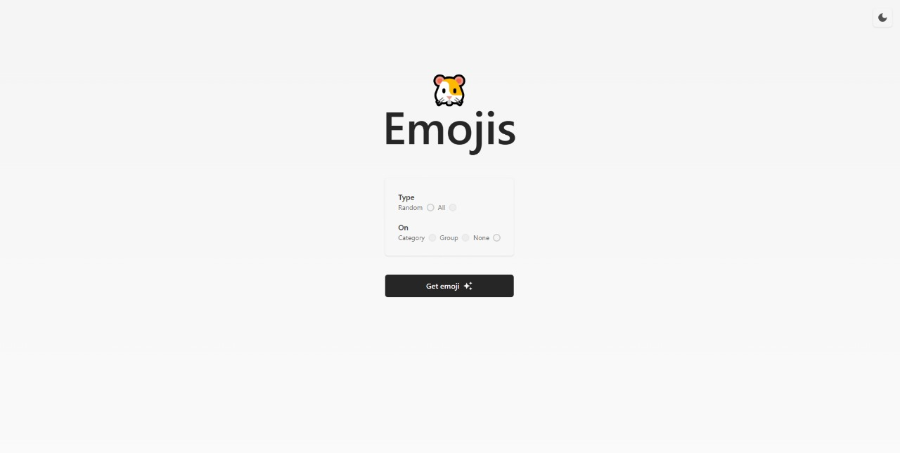
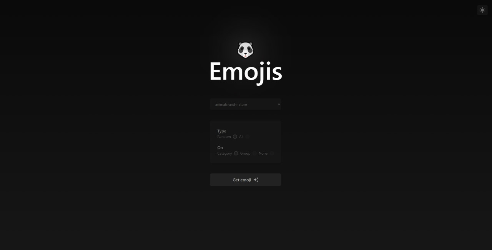
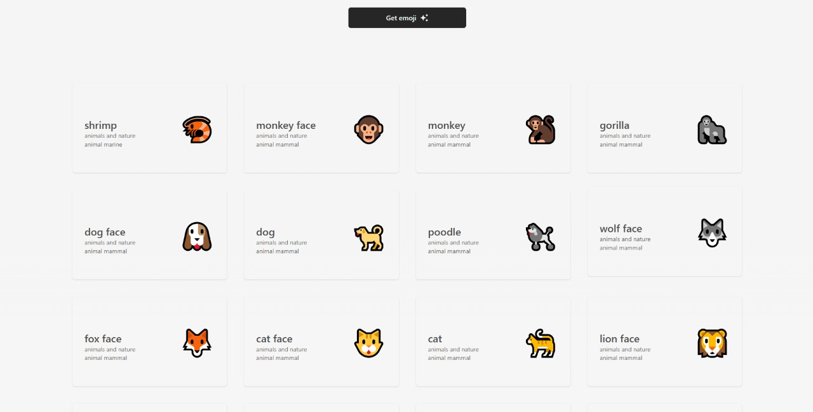
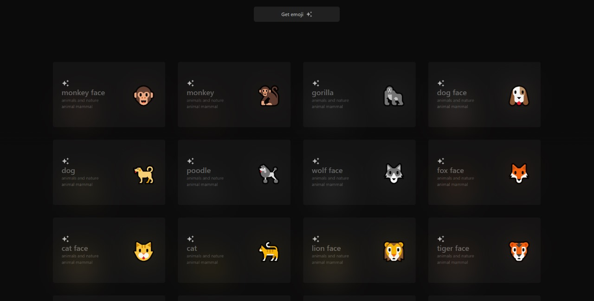

# 🍜 Emojis

Discover a new emoji that you may have never seen before or take a look at a whole range of emojis.

This project uses [EmojiHub](https://github.com/cheatsnake/emojihub), take a look 🐱. Thank you very much to [cheatsnake](https://github.com/cheatsnake).

## 🍚 How does it work?

Thanks to a simple search section, you can select if you want a random emoji or all of them.

That's not all, you can also make a more precise search by selecting the category or group you prefer.

Writing a category or group is a bit complicated, especially when you are not sure of its name, this is not a problem, browse through the options and select the one you like the most.

## 🍣 Dark mode

Switching from dark to light mode is just a click away. Choose the one you like best. Although I recommend you to take a look at the dark mode and see the light effects.




## 🥗 Additional features

1. The valuable opportunity to see cute kittens and other small animals 🐈.
2. Click on an emoji and copy its html code to use it in your web page 🚲.
3. Hang out and get rid of stress 🌱.




## 🍱 Installation and usage

I built this project to learn much more about Angular, maybe you are also doing the same, if so, do not stop believing in you and what you can do, even if the road is cloudy, in time it will shine as much as you, a hug 🍃.

1. Open your terminal, remember to have nodejs installed. If you don't know how to install it, go [here](https://nodejs.org/en/learn/getting-started/how-to-install-nodejs) and install it.
2. Make sure you are in the project directory and run the following command:

```sh
npm install
```

3. Start the project using:

```sh
npx ng serve -o
```

Made with ❤
