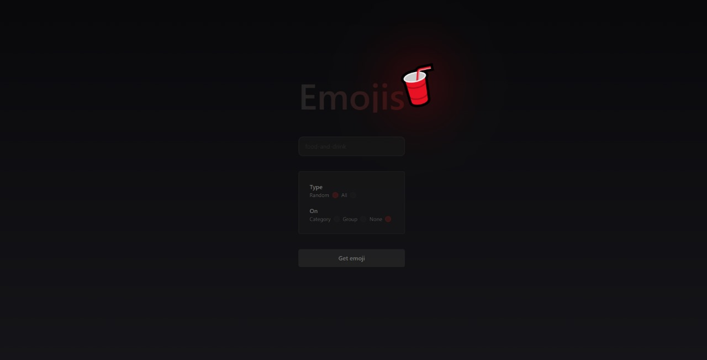

# Emojis

Project with the purpose of practicing Angular and making use of the [EmojiHub](https://github.com/cheatsnake/emojihub) API.

## Installation and usage

1. `npm install`
2. `npx ng serve -o`

## Preview

This project was generated with [Angular CLI](https://github.com/angular/angular-cli) version 17.2.2.
